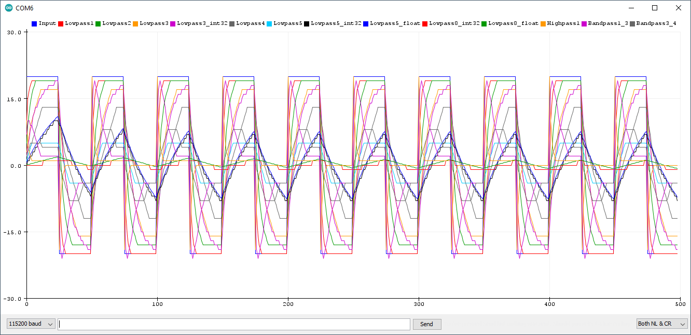

<div align = center>

# [ArduinoUtils](https://github.com/ArminJo/Arduino-Utils)
My utility collection for Arduino

[](https://www.gnu.org/licenses/gpl-3.0)
 &nbsp; &nbsp;
[](https://github.com/ArminJo/Arduino-Utils/releases/latest)
 &nbsp; &nbsp;
[](https://github.com/ArminJo/Arduino-Utils/commits/master)
 &nbsp; &nbsp;
[](https://github.com/ArminJo/Arduino-Utils/actions)
 &nbsp; &nbsp;

<br/>
<br/>
[](https://stand-with-ukraine.pp.ua)

Not yet available as Arduino library.

[](https://www.ardu-badge.com/Arduino-Utils)
 &nbsp; &nbsp;
[](https://arminjo.github.io/Arduino-Utils/classArduino-Utils.html)
 &nbsp; &nbsp;
[](https://github.com/ArminJo/Arduino-Utils#revision-history)

</div>

<br/>

# Table of content
* [SimpleEMAFilters.hpp](https://github.com/ArminJo/Arduino-Utils#simpleemafiltershpp)
* [ADCUtils.cpp](https://github.com/ArminJo/Arduino-Utils#adcutilscpp)
* [HCSR04](https://github.com/ArminJo/Arduino-Utils#hcsr04)
* [MeasureVoltageAndResistance.hpp](https://github.com/ArminJo/Arduino-Utils#measurevoltageandresistancehpp)
* [BlinkLed.cpp](https://github.com/ArminJo/Arduino-Utils#blinkledcpp)
* [ShowInfo](https://github.com/ArminJo/Arduino-Utils#showinfo)
* [HexDump](https://github.com/ArminJo/Arduino-Utils#hexdump)
* [AVRUtils.cpp](https://github.com/ArminJo/Arduino-Utils#avrutilscpp)
* [MillisUtils.cpp](https://github.com/ArminJo/Arduino-Utils#millisutilscpp)
* [DebugLevel.h](https://github.com/ArminJo/Arduino-Utils#debuglevelh)
* [ATtinyUtils.cpp](https://github.com/ArminJo/Arduino-Utils#attinyutilscpp)
* [AvrTracing.hpp](https://github.com/ArminJo/Arduino-Utils#avrtracinghpp)
* [Utilities available as separate Arduino library](https://github.com/ArminJo/Arduino-Utils#utilities-available-as-separate-arduino-library)
  * [ATtinySerialOut.cpp](https://github.com/ArminJo/Arduino-Utils#attinyserialoutcpp)
  * [EasyButtonAtInt01.hpp](https://github.com/ArminJo/Arduino-Utils#easybuttonatint01hpp)
  * [The very useful digitalWriteFast.h file based on the version from Watterott electronic.](https://github.com/ArminJo/Arduino-Utils#the-very-useful-digitalwritefasth-file-based-on-the-version-from-watterott-electronic)
* [Revision History](https://github.com/ArminJo/Arduino-Utils#revision-history)
* [CI](https://github.com/ArminJo/Arduino-Utils#ci)

# SimpleEMAFilters.hpp
An EMA (**Exponential Moving Average**) filter behaves like an RC lowpass filter with RC = SamplePeriod((1-alpha)/alpha) see [here](https://en.wikipedia.org/wiki/Low-pass_filter#Simple_infinite_impulse_response_filter).<br/>
An EMA filter is implemented by e.g. the following statement:

```c++
int16_t Lowpass5 += ((InputValue - Lowpass5) >> 5;
```
which takes **2.5 &micro;s on a 16 MHz Arduino Uno**.

The alpha's for the implemented **ultra fast EMA filters** are 1/2, 1/4, 1/8, 1/16, 1/32 and 1/256 corresponding to the shift values of 1, 2, 3, 4, 5 and 8.

### For a 1 kHz sampling rate (1/1000s sampling interval) we get the following equivalent cutoff (-3db) frequencies:
Simplified formula for small alpha is CutoffFrequency = (SampleFrequency / (2&pi; * ((1/alpha) - 1));
- For alpha 1/2 (shift 1) -> (160 Hz / 1)  With 1 = (1/alpha) - 1
- 1/4 (shift 2) -> 53 Hz (160 Hz / 3)  With 3 = (1/alpha) - 1
- 1/8 -> 22.7 Hz (160 Hz / 7)
- 1/16 -> 10.6 Hz (160 Hz / 15)
- 1/32 -> 5.13 Hz (160 Hz / 31)
- 1/256 -> 0.624 Hz (160 Hz / 255)

Using the [more exact formula](https://github.com/MakeMagazinDE/DigitaleFilter/blob/main/Filter-Berechnungen.xlsx), alpha = 1 - e ^ -((2&pi; * CutoffFrequency) / SampleFrequency)  
=> CutoffFrequency = (-ln(1-alpha) * SampleFrequency) / 2&pi; we get the values:
- 110 Hz
- 46 Hz
- 21.2 Hz
- 10.3 Hz
- 5.05 Hz

The **maximum output value for integer filters** is: InputValue - ((1 << (ShiftValue -1)) -1), i.e **85 for InputValue 100 and ShiftValue 5** (Lowpass5).

### The [SimpleEMAFilters.hpp](https://github.com/ArminJo/Arduino-Utils/blob/master/src/SimpleEMAFilters.hpp#L66) contains:
- A fixed set of 6 **ultrafast** EMA (Exponential Moving Average) filters which require only **1 to 2 microseconds**.
- 3 derived filters (highpass and 2 bandpasses) by just subtracting one lowpass from input (highpass) or from another lowpass (bandpass).
- Display routines for Arduino Plotter.

All implemented filters are applied at once to the input test signal calling `doFiltersStep(int16_t aInput)` and the results can in turn easily be displayed in the Arduino Plotter.

### Plotter outputs representing e.g. a 40, 20, 10, 5 Hz square / sine wave at a sample rate of 1 ms (or 80, 40 ... Hz at 0.5 ms and so on)


Arduino Plotter output for a rectangle input signal with a amplitude of +/- 100. E.g. Lowpass3 is the one with alpha 1/8 implemented by `>> 3` and the cutoff frequency of 21 Hz.
<br/><br/>
Note the following facts:
- Highpass is always Input - Lowpass.
- The Bandpass1_3 has an overshoot.
- The 2 Lowpass3 and the 2 Lowpass5 lines are overlapping each other for this (high) amplitude.
- The output of DoubleLowpass3 and 4 is more and more resembling a delayed sine.
- The output of Lowpass5 and DoubleLowpass4 have almost the same amplitude but DoubleLowpass4 is way more resembling a (delayed) sine.
- The output of TripleLowpass3 has a higher amplitude than DoubleLowpass4 with both looking quite like a (delayed) sine.

<br/>


Arduino Plotter output for a rectangle input signal with very low amplitude of +/- 20 where you see clipping effects due to the limited resolution of the used 16 bit math.<br/>
The Lowpass3_int32 and Lowpass5_int32 are 32 bit fixed point implementations for higher resolution which requires **4.2 &micro;s instead of the 1.8 / 2.5 &micro;s of 16 bit**.
<br/><br/>


Arduino Plotter output for a sine input signal with a amplitude of +/- 100.<br/>
Note the **-3db attenuation for the Lowpass3** value which represent a filter of 22.7 Hz in this example.
<br/><br/>


Arduino Plotter output for a triangle input signal with a amplitude of +/- 100.<br/>
Note that Lowpass5 is almost a perfect sine.

The floating point implementation of the 1/32 EMA filter takes **24 to 34 &micro;s**.<br/>
There are convenience functions implemented for EMA filter, but normally it is better to implement it inline by e.g.

```c++
int16_t Lowpass3;
int16_t Lowpass5;
int32_t Lowpass5_int32;
..
Lowpass3 += ((InputValue - Lowpass3) + (1 << 2)) >> 3; // 1.8 us, alpha = 0.125, cutoff frequency 22.7 Hz @1kHz
Lowpass5 += ((InputValue - Lowpass5) + (1 << 4)) >> 5; // 2.5 us, alpha = 1/32 0.03125, cutoff frequency 5.13 Hz @1kHz
Lowpass5_int32 += ((((int32_t) InputValue) << 8) - Lowpass5_int32) >> 5; // Fixed point 4.2 us, value is Lowpass5_int32 >> 8
Lowpass8_int32 += ((((int32_t) InputValue) << 16) - Lowpass8_int32) >> 8; // Fixed point 2.0 us because of fast shift, value is Lowpass8_int32 >> 16
```

**!Attention!** The 16 bit implementations are limited to a **maximum input value of +/- 16383** for rectangular input (which is the worst input case). The reason is, that the term `InputValue - Lowpass3` must always fit into a 16 bit signed integer.

### Related Links
- https://en.wikipedia.org/wiki/Moving_average#Exponential_moving_average
- https://www.dsprelated.com/blogimages/RickLyons/Exponential_Averaging_FIGURE2.gif
- https://www.norwegiancreations.com/2015/10/tutorial-potentiometers-with-arduino-and-filtering/
- https://www.norwegiancreations.com/2016/08/double-exponential-moving-average-filter-speeding-up-the-ema/
- https://www.norwegiancreations.com/2016/03/arduino-tutorial-simple-high-pass-band-pass-and-band-stop-filtering/
- https://arduinokickstompdrum.wordpress.com/2021/05/14/simple-filtering/
- https://github.com/popcornell/Arduino-Multiplierless-EMA-filter
- https://github.com/MakeMagazinDE/DigitaleFilter

# ADCUtils.cpp
Fast and flexible ADC conversions. **Intelligent handling of delays for reference and channel switching**.
- Functions for easy **oversampling**.
- Function for easy getting the maximum value of measurements.
- Functions for getting **temperature and VCC voltage**.  For VCC, resolution is 20 millivolt!
- Functions to check if voltage is too low for a given period, used especially for Li-ion batteries supply.

# HCSR04
- Blocking and **non-blocking** reading of HCSR04 US Sensors with timeouts and exact conversions.
- Supports also **1 Pin mode** available with the HY-SRF05 or Parallax PING modules.

### You can modify the HCSR04 modules to 1 Pin mode:
1. Old module with 3 16 pin chips:<br/>
   Connect Trigger and Echo direct or use a resistor < 4.7 k&ohm;.
   If you remove both 10 k&ohm; pullup resistor you can use a connecting resistor < 47 k&ohm;, but I suggest to use 10 k&ohm; which is more reliable.
2. Old module with 3 16 pin chips but with no pullup resistors near the connector row:<br/>
   Connect Trigger and Echo with a resistor > 200 &ohm;. Use 10 k&ohm;.
3. New module with 1 16 pin and 2 8 pin chips:<br/>
   Connect Trigger and Echo by a resistor > 200 &ohm; and < 22 k&ohm;.
4. All modules:<br/>
   Connect Trigger and Echo by a resistor of 4.7 k&ohm;.

# MeasureVoltageAndResistance.hpp
Measures voltage and resistance with **1 mV and 2 &ohm; resolution** at the lower end.<br/>
First voltage is measured. If voltage is zero, then the unknown resistance to ground is measured using the 5 volt (VCC) supply with internal/series resistance of 10 k&ohm; or 100 k&ohm;.

### Fritzing board

### Fritzing schematics


# BlinkLed.cpp
- Class for blinking one ore more LED's in different fashions.

# ShowInfo
- Serial.print display of timer and other peripheral and system registers (to be extended :-)).

# HexDump
- Creates hex memory dumps on serial output.

```
0x0000:  0xFF 0x81 0x82 0x00 0x08 0x02 0x00 0x27 0xFF 0xFF 0x0E 0xB3 0x81 0xFC 0x9B 0x47   .. .. '  .....G
0x0020:  0x00 0x00 0x00 0x00 0x20 0x65 0x00 0x0F 0xBE 0xEB 0x9B 0x98 0x2C 0xF1 0x08 0x2C       e .....,..,
0x0040:  0x55 0x55 0x55 0x55 0x55 0x55 0x55 0x55 0x55 0x55 0x55 0x55 0x55 0x55 0x55 0x55  UUUUUUUUUUUUUUUU
```

# AVRUtils.cpp
- Sleep and sleep with watchdog functions.
- Available Ram, Heap / Stack memory display.

# MillisUtils.cpp
Unifies millis() timer handling for Digispark, AttinyCore and Arduino cores.
- Start, stop and modify milliseconds timer and value.
- Functions to compensate `millis()` after long running tasks in `noIterrupt()` context like NeoPixel output, ADC buffer reading etc.
- Blocking delayMilliseconds() function for use in noInterrupts context like ISR.

# DebugLevel.h
- Propagating debug levels for development. Supports level `TRACE, DEBUG, INFO, WARN and ERROR`.
- **Includes an explanation of semantics of these levels**.

# ATtinyUtils.cpp
- `toneWithTimer1PWM()`.
- `noToneWithTimer1PWM()`.
- `isBODSFlagExistent()` -> checking for ATtiny85 revision C.
- fuse reading function.
- `changeDigisparkClock()` to use Digispark boards with no Digispark core like e.g. ATTinyCore by [Spence Konde](https://github.com/SpenceKonde/ATTinyCore).
It changes Digispark Bootloader clock settings to get the right CPU frequency and resets Digispark OCCAL tweak.
Consider to use new [optimized Digispark core](https://github.com/ArminJo/DigistumpArduino) instead.

# AvrTracing.hpp
**Tracing an Arduino program** by printing each program counter value after executing one instruction.

# Utilities available as separate Arduino library

## [ATtinySerialOut.cpp](https://github.com/ArminJo/ATtinySerialOut/src)
Minimal bit-bang send serial
- 115200 baud for 1/8/16 MHz ATtiny clock.
The utility for serial output for ATtinies is contained in the [ATtinySerialOut library](https://github.com/ArminJo/ATtinySerialOut)
available as an Arduino library.

## [EasyButtonAtInt01.hpp](https://github.com/ArminJo/EasyButtonAtInt01/src)
- Arduino library for handling push buttons just connected between ground and INT0 and / or INT1 pin.
- No external pullup, **no polling needed**.
The utility for easy button handling for ATmegas or ATtinies is contained in the [EasyButtonAtInt01 library](https://github.com/ArminJo/EasyButtonAtInt01)
available as an Arduino library.

## The very useful *[digitalWriteFast.h file](https://github.com/ArminJo/Arduino-Utils/blob/master/src/digitalWriteFast.h)* based on the version from [Watterott electronic](https://github.com/watterott/Arduino-Libs).

### Changing include (*.h) files with Arduino IDE
First, use *Sketch > Show Sketch Folder (Ctrl+K)*.<br/>
If you have not yet saved the example as your own sketch, then you are instantly in the right library folder.<br/>
Otherwise you have to navigate to the parallel `libraries` folder and select the library you want to access.<br/>
In both cases the library source and include files are located in the libraries `src` directory.<br/>
The modification must be renewed for each new library version!

### Modifying compile options with Sloeber IDE
If you are using [Sloeber](https://eclipse.baeyens.it) as your IDE, you can easily define global symbols with *Properties > Arduino > CompileOptions*.<br/>


# Revision History

### Version 1.1.0 - work in progress
- SimpleEMAFilters: Added "State Variable" / Biquad and double and triple Lowpass filters.
- ADCUtils: Renamed `*VoltageCheck*()` to `*VCCCheck*()`, `setADCMultiplexerAndReferenceForNextConversion()` to `setADCChannelAndReferenceForNextConversion()` and changed signature of `readUntil4ConsecutiveValuesAreEqual()`.
- Improvements.
- Documentation.

### Version 1.0.0
- Added unions.
- Changed distance return value for overflow to 0.
- Miscellaneous improvements.

### Version 0.8.0
- Initial version

# CI
The library examples are tested with GitHub Actions for the following boards:

- Arduino Uno
- Arduino Leonardo
- Digispark (using ATTiny85 @1MHz)
- Generic ATTiny85 @1MHz

#### If you find this library useful, please give it a star.
