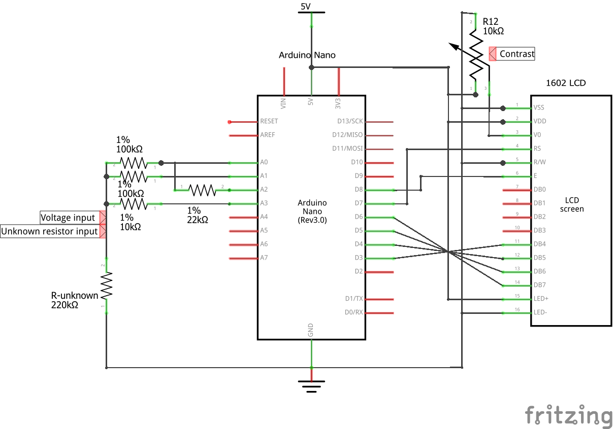

# [ArduinoUtils](https://github.com/ArminJo/Arduino-Utils)

### [Version 1.0.0](https://github.com/ArminJo/Arduino-Utils/archive/master.zip)

[](https://www.gnu.org/licenses/gpl-3.0)
[](https://github.com/ArminJo/Arduino-Utils/actions)


## My utility collection for Arduino

### SimpleEMAFilters.cpp
- A fixed set of 6 **ultrafast EMA (Exponential Moving Average) filters** which require only **1 to 2 microseconds**.
- 3 derived filters (highpass and 2 bandpasses) by just subtracting one lowpass from input (highpass) or from another lowpass (bandpass).
- Display routines for Arduino Plotter.
An EMA filter behaves like an RC lowpass filter with RC = SamplePeriod((1-alpha)/alpha) see [here](https://en.wikipedia.org/wiki/Low-pass_filter#Simple_infinite_impulse_response_filter).<br/>
The alpha's for the implemented **ultrafast EMA filters** are 1/2, 1/4, 1/8, 1/16, 1/32, and 1/256.
#### For a 1 kHz sampling rate (1/1000s sampling interval) we get the following equivalent cutoff (-3db) frequencies:
- 1/2 -> 160 Hz
- 1/4 -> 53 Hz (160 / 3)
- 1/8 -> 22.7 Hz (160 / 7)
- 1/16 -> 10.6 Hz
- 1/32 -> 5.13 Hz
- 1/256 -> 0.624 Hz (160 / 255)

#### Plotter output representing e.g. a 20 Hz square / sine wave at a sample rate of 1 ms (or 40 Hz at 0.5 ms and so on)
Arduino Plotter output for a rectangle input signal with a amplitude of +/- 100. E.g. Lowpass3 is the one with alpha 1/8 implemented by `>> 3`.

Arduino Plotter output for a rectangle input signal with very low amplitude of +/- 20 where you see clipping effects due to the limited resolution of the used 16 bit math. The Lowpass3_int32 and Lowpass5_int32 are 32 bit fixed point implementations for higher resolution which requires 4.2 µs.

Arduino Plotter output for a sine input signal with a amplitude of +/- 100. Note the **-3db attenuation for the Lowpass3** value which represent a filter of 22.7 Hz in this example.

Arduino Plotter output for a triangle input signal with a amplitude of +/- 100. Note that Lowpass5 is almost a perfect sine.


***Attention!** The 16 bit implementations are limited to a **maximum input value of +/- 16383** for rectangular input (which is the worst input case). The reason is, that the term `InputValue - Lowpass3` must always fit into a 16 bit signed integer.

The floating point implementation of the 1/32 EMA filter takes 24 to 34 µs.<br/>

All filters are applied to your test signal calling `doFiltersStep(int16_t)` and the results can in turn easily be displayed in the Arduino Plotter.<br/>
There is no function implemented for one EMA filter, since it is better to implement it directly by e.g.
```
int16_t Lowpass3;
int32_t Lowpass5_int32;
..
Lowpass3 += ((InputValue - Lowpass3) + (1 << 2)) >> 3; // 1.8 us, alpha = 0.125, cutoff frequency 22.7 Hz @1kHz
Lowpass5 += ((InputValue - Lowpass5) + (1 << 4)) >> 5; // 2.5 us, alpha = 1/32 0.03125, cutoff frequency 5.13 Hz @1kHz
Lowpass5_int32 += ((((int32_t) InputValue) << 8) - Lowpass5_int32) >> 5; // Fixed point 4.2 us, value is Lowpass5_int32 >> 8
Lowpass8_int32 += ((((int32_t) InputValue) << 16) - Lowpass8_int32) >> 8; // Fixed point 2.0 us because of fast shift, value is Lowpass8_int32 >> 16
```
#### Related Links
- https://en.wikipedia.org/wiki/Moving_average#Exponential_moving_average
- https://www.dsprelated.com/blogimages/RickLyons/Exponential_Averaging_FIGURE2.gif
- https://www.norwegiancreations.com/2015/10/tutorial-potentiometers-with-arduino-and-filtering/
- https://www.norwegiancreations.com/2016/08/double-exponential-moving-average-filter-speeding-up-the-ema/
- https://www.norwegiancreations.com/2016/03/arduino-tutorial-simple-high-pass-band-pass-and-band-stop-filtering/
- https://github.com/popcornell/Arduino-Multiplierless-EMA-filter


### ADCUtils.cpp
Fast and flexible ADC conversions. Intelligent **handling of reference switching**.
- Functions for easy **oversampling**.
- Function for easy getting the maximum value of measurements.
- Functions for getting **temperature and VCC voltage**.  For VCC, resolution is only 20 millivolt!


### HCSR04
- Blocking and **non-blocking** reading of HCSR04 US Sensors with timeouts and exact conversions.
- Supports also **1 Pin mode** available with the HY-SRF05 or Parallax PING modules.

#### You can modify the HCSR04 modules to 1 Pin mode by:
1 Old module with 3 16 pin chips: Connect Trigger and Echo direct or use a resistor < 4.7 kOhm. 
If you remove both 10 kOhm pullup resistor you can use a connecting resistor < 47 kOhm, but I suggest to use 10 kOhm which is more reliable.
2 Old module with 3 16 pin chips but with no pullup resistors near the connector row: Connect Trigger and Echo with a resistor > 200 Ohm. Use 10 kOhm.
3 New module with 1 16 pin and 2 8 pin chips: Connect Trigger and Echo by a resistor > 200 Ohm and < 22 kOhm.
4 All modules: Connect Trigger and Echo by a resistor of 4.7 kOhm.

### MeasureVoltageAndResistance.hpp
Measures voltage and resistance with 1 mV and 2 Ohm resolution at the lower end.<br/>
First voltage is measured. If voltage is zero, then resistance to ground is measured using 5 volt (VCC) and 10 kOhm or 100 kOhm supply.

### Fritzing board

### Fritzing schematics


### BlinkLed.cpp
- Class for blinking one ore more LED's in different fashions.

### ShowInfo
- Serial.print display of timer and other peripheral and system registers (to be extended :-)).

### AVRUtils.cpp
- Sleep and sleep with watchdog functions.
- Available Ram, Heap / Stack memory display.

### MillisUtils.cpp
Unifies millis() timer handling for Digispark, AttinyCore and Arduino cores.
- Start, stop and modify milliseconds timer and value.
- Functions to compensat `millis()` after long running tasks in `noIterrupt()` context like NeoPixel output, ADC buffer reading etc.
- Blocking delayMilliseconds() function for use in noInterrupts context like ISR.

### DebugLevel.h
- Propagating debug levels for development. Supports level `TRACE, DEBUG, INFO, WARN and ERROR`. 
- **Includes an explanation of semantics of these levels**.

### ATtinyUtils.cpp
- `toneWithTimer1PWM()`.
- `isBODSFlagExistent()` -> checking for ATtiny85 revision C.
- fuse reading function.
- `changeDigisparkClock()` to use Digispark boards with no Digispark core like e.g. ATTinyCore by [Spence Konde](https://github.com/SpenceKonde/ATTinyCore). 
It changes Digispark Bootloader clock settings to get the right CPU frequency and resets Digispark OCCAL tweak. Consider to use new [optimized Digispark core](https://github.com/ArminJo/DigistumpArduino) instead. 

### AvrTracing.hpp
**Tracing an Arduino program** by printing each program counter value after executing one instruction.

## Utilities available as separate Arduino library

### [ATtinySerialOut.cpp](https://github.com/ArminJo/ATtinySerialOut/src)
Minimal bit-bang send serial
- 115200 baud for 1/8/16 MHz ATtiny clock.
The utility for serial output for ATtinies is contained in the [ATtinySerialOut](https://github.com/ArminJo/ATtinySerialOut)
library available as an Arduino library.

### [EasyButtonAtInt01.hpp](https://github.com/ArminJo/EasyButtonAtInt01/src)
- Arduino library for handling push buttons just connected between ground and INT0 and / or INT1 pin.
- No external pullup, **no polling needed**.
The utility for easy button handling for ATmegas or ATtinies is contained in the [EasyButtonAtInt01](https://github.com/ArminJo/EasyButtonAtInt01)
library available as an Arduino library.

### The very useful *digitalWriteFast.h* file from  [Watterott electronic](https://github.com/watterott/Arduino-Libs).

### Modifying compile options with Arduino IDE
First, use *Sketch > Show Sketch Folder (Ctrl+K)*.<br/>
If you did not yet stored the example as your own sketch, then you are instantly in the right library folder.<br/>
Otherwise you have to navigate to the parallel `libraries` folder and select the library you want to access.<br/>
In both cases the library files itself are located in the `src` directory.<br/>

### Modifying compile options with Sloeber IDE
If you are using Sloeber as your IDE, you can easily define global symbols with *Properties > Arduino > CompileOptions*.<br/>


# Revision History

### Version 1.0.0 - work in progress
- Added unions.
- Changed distance return value for overflow to 0.

# Travis CI
The ArduinoUtils library examples are built on Travis CI for the following boards:

- Arduino Uno
- Arduino Leonardo
- Digispark (using ATTiny85 @1MHz)
- Generic ATTiny85 @1MHz

## Requests for modifications / extensions
Please write me a PM including your motivation/problem if you need a modification or an extension.

#### If you find this library useful, please give it a star.
